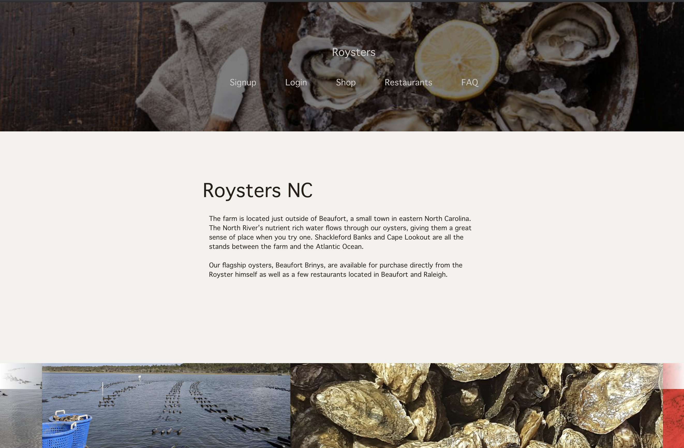
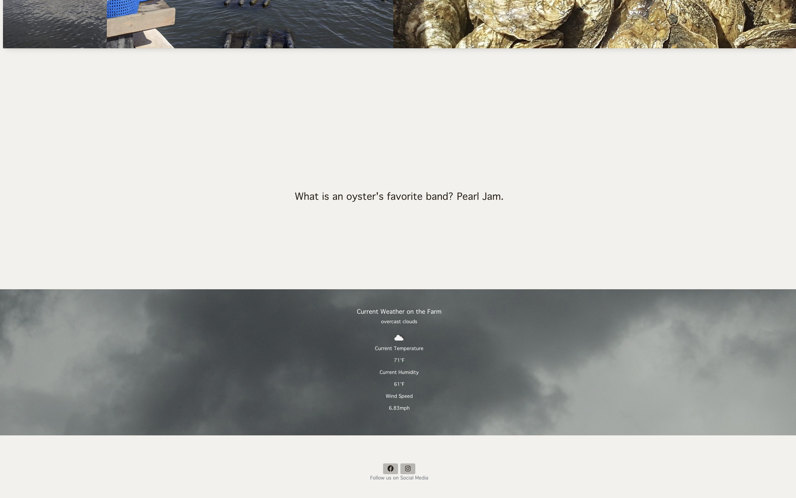

# Roysters
    

## Table of Contents
  - [Description](#description)
  - [Screenshot](#screenshot)
  - [Built With](#built-with)
  - [`Future Development`](#future-development)
  - [Questions](#questions)
  - [Contributing](#contributing)

## Description
Roysters Nc is a small family owned and operated business that provides customers with ethically harvested farm to table oysters for purchase. Our team has created a react application for this business that serves as both a marketing tool for Royster’s and a purchasing platform for customers. Users who visit our site will be able to do more than just purchase oysters, though. We’ve included educational info about oysters, detailed local
weather on the farm, a library of photographs and more to give the user a sense of place when interacting with our site.

### [Live Link](https://young-shelf-14995.herokuapp.com/) ###

## Packages: 📦
npm, 

## Screenshots
 
 

## Built With
* Javascript
* React
* Bootstrap
* Node 
* GraphQL APIs
* Concurrent servers in a MERN app
* JWT/GraphQL Authentication
* NoSql Databases
* IndexedDB for data persistence
* STRIPE
* OpenWeather

## Future Development
For future development, we would like to add a Google Maps API for the Restaurant page. We would like to add an events page, environmental charity work page, contact page & "meet the farmers" page. We would like to integrate Royster's instagram feed into the site & add a mailing list functionality. 
Google Maps API for Restaurant Page

## Questions
✉️ Contact us with any questions: [email](mailto:mallory.korpics0@gmail.com), [GitHub](https://github.com/mallynnk) 

## Contributions
* Grant Emerson https://github.com/nosremetnarg
* Mallory Korpics https://github.com/mallynnk
* Melanie Gilman https://github.com/melaniegilman

